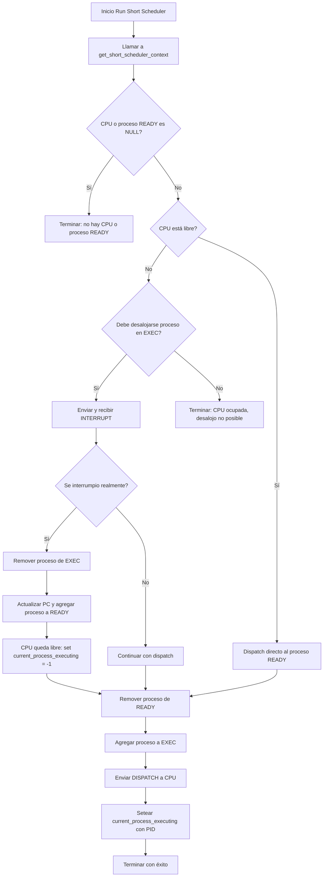

```mermaid
flowchart TD
    A[Inicio Run Short Scheduler] --> B[Llamar a get_short_scheduler_context]
    B --> C{CPU o proceso READY es NULL?}
    C -->|Sí| D[Terminar: no hay CPU o proceso READY]
    C -->|No| E{CPU está libre?}
    E -->|Sí| F[Dispatch directo al proceso READY]
    E -->|No| G{Debe desalojarse proceso en EXEC?}
    G -->|Sí| H[Enviar y recibir INTERRUPT]
    H --> I{Se interrumpio realmente?}
    I -->|Sí| J[Remover proceso de EXEC]
    J --> K[Actualizar PC y agregar proceso a READY]
    K --> L[CPU queda libre: set current_process_executing = -1]
    I -->|No| M[Continuar con dispatch]
    G -->|No| N[Terminar: CPU ocupada, desalojo no posible]
    L --> O[Remover proceso de READY]
    M --> O
    F --> O
    O --> P[Agregar proceso a EXEC]
    P --> Q[Enviar DISPATCH a CPU]
    Q --> R[Setear current_process_executing con PID]
    R --> S[Terminar con éxito]
```
